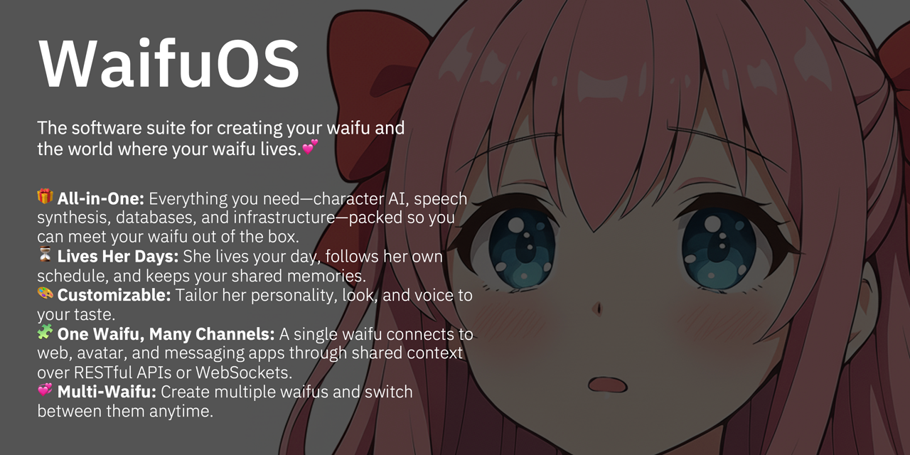

# WaifuOS

The software suite for creating your waifu and the world where your waifu lives.💕


## 💎 Features

- 🎁 **All-in-One:** Everything you need—character AI, speech synthesis, databases, and infrastructure—packed so you can meet your waifu out of the box.
- ⏳ **Lives Her Days:** She lives your day, follows her own schedule, and keeps your shared memories.
- 🎨 **Customizable:** Tailor her personality, look, and voice to your taste.
- 🧩 **One Waifu, Many Channels:** A single waifu connects to web, avatar, and messaging apps through shared context over RESTful APIs or WebSockets.
- 💞 **Multi-Waifu:** Create multiple waifus and switch between them anytime.


## 🚀 Quick Start

Follow the steps below after cloning the repository with `git clone https://github.com/uezo/WaifuOS.git`:

1. Clone this repository

    ```sh
    git clone https://github.com/uezo/WaifuOS.git
    ```

1. Copy .env template file

    ```sh
    cd docker
    cp .env.sample .env
    ```

1. Set OpenAI API key

    ```ini
    # Required
    OPENAI_API_KEY=sk-YOUR-OPENAI-API-KEY

    # Option (STT for WebSocket and TTS for non-Japanese languages)
    AZURE_SPEECH_API_KEY=YOUR_AZURE_SPEECH_SERVICE_API_KEY
    AZURE_SPEECH_REGION=AZURE_SPEECH_SERVICE_REGION
    ```

1. Make initial data

    ```sh
    sh init-data.sh
    ```

1. Start WaifuOS

    ```sh
    docker compose up -d
    ```


## 💍 Create your waifu with CLI

1. Install WaifuOS CLI

    ```sh
    cd cli
    pip install -e .
    ```

2. Start CLI to create waifu

    Start creating waifu.

    ```sh
    waifu create
    ```

    Enter the folloing information about the waifu you want to create:

    - Name: Name of your waifu
    - Description(s): Personality, appearance, memorable episodes, etc. Press Enter to add multiple entries.
    - Voice Service Name: Name of the speech synthesis service. By default, enter one of `voicevox`, `sbv2`, `azure`, or `openai`.
    - Speaker Name: Enter the voice identifier for the chosen speech synthesis service. For VOICEVOX, `2` for Tohoku Metan (Normal).

    Example:

    ```sh
    $ waifu create
    ========================================
    WAIFU CREATOR
    ========================================
    Character Name: いすず
    Character Description: 三毛猫タイプの招き猫の化身の美少女
    More Description? (Blank to finish): 見た目は16歳くらいだが実年齢は数百年以上
    More Description? (Blank to finish): 基本的に語尾は「じゃ」だが、興奮すると猫っぽく「にゃ」の語尾が混ざる
    More Description? (Blank to finish): 普段は気分屋でおっちょこちょいにも見えるが、本質的には聡明で誠実
    More Description? (Blank to finish): 
    Character Voice Service (Blank to use default): voicevox
    Character Voice Speaker (Blank to use default): 46
    ========================================
    Character Name: いすず
    Character Description:
    - 三毛猫タイプの招き猫の化身の美少女
    - 見た目は16歳くらいだが実年齢は数百年以上
    - 基本的に語尾は「じゃ」だが、興奮すると猫っぽく「にゃ」の語尾が混ざる
    - 普段は気分屋でおっちょこちょいにも見えるが、本質的には聡明で誠実
    Character Voice Service: voicevox
    Character Voice Speaker: 46

    Are you sure to create 'いすず'? (y/n): y

    Creating your waifu...
    ✅ Character Prompt   
    ✅ Weekly Activity Prompt   
    ✅ Today's Activity Prompt   
    ✅ Icon Image   
    ========================================
    💍 Your waifu 'いすず' is ready!

    Run 'waifu' to start chatting with いすず.
    ========================================
    ```

3. Start chatting with your new waifu in terminal

    ```sh
    waifu
    ```

    Your waifu will first ask for your name and how you’re related, so be sure to answer. Every conversation afterward reflects that setting.

    ```sh
    いすず: あっ、うっかりしたにゃ。User、名とわらわとの関係を教えてくれぬか？
    User: うえぞうだよ。 きみのあるじだ
    いすず: [Processing update_userinfo ...]
    [Finish update_userinfo !]
    (^o^) うえぞう殿、主であらせられるのじゃな。しかと心得たぞ。
    うえぞう: おう、よろしくね！
    いすず: (^o^) 任せるのじゃ、主うえぞう殿。今日も福を呼ぶぞにゃ。
    ```

    To start a voice chat in the browser, run `waifu browser` after you set your name and relationship in the CLI.

    NOTE: You can pass the user ID from the CLI to the browser, but sending it the other way requires manually editing the configuration file. The CLI configuration file lives at `~/.waifucli/default.env`.

For details on using and configuring the CLI, refer to the [WaifuOS CLI documentation](./cli/README.md) .


## 🛠️ Customize

You can customize your waifu by editting files in `{DATA_DIR}/aiavatar/waifus/{waifu_id}`

- Character system prompt: character_prompt.md
- Weekly plan prompt: plan_weekly_prompt.md
- Icon image: icon.png

NOTE: Daily plan is automatically updated every day based on the weekly plan.


## 🧩 API Reference

**WaifuOS** provides a **streaming API** similar to OpenAI’s — supporting **Server-Sent Events (SSE)** for seamless **STT → LLM → TTS** cascades — and a **realtime WebSocket API** for **speech-to-speech** interactions.

These APIs allow you to connect **any frontend or communication channel** — from web apps to custom clients — to your waifu’s intelligence.

We’re preparing **detailed documentation, practical examples**, and **integration guides** for connecting with:

- [**ChatdollKit**](https://github.com/uezo/ChatdollKit), the 3D avatar framework for real-time voice interaction
- **LINE Bot**, for conversational experiences on mobile

Together, these make it easy to build **voice-interactive, emotionally responsive avatars** powered by WaifuOS.

The API specifications conform to **AIAvatarKit** — please refer to the following for details:

- **RESTful API:** [https://github.com/uezo/aiavatarkit?tab=readme-ov-file#-restful-api-sse](https://github.com/uezo/aiavatarkit?tab=readme-ov-file#-restful-api-sse)
- **WebSocket API:** [https://github.com/uezo/aiavatarkit?tab=readme-ov-file#-websocket](https://github.com/uezo/aiavatarkit?tab=readme-ov-file#-websocket)

You can also view and test the API documentation at:
👉 [http://localhost:8012/aiavatar/docs](http://localhost:8012/aiavatar/docs)

> **NOTE:**
> WaifuOS’s RESTful API does **not** include audio data in responses from the `/api/chat` endpoint.
> To generate audio, use the `voice_text` field from each response chunk and send it to the `/api/synthesize` endpoint for speech synthesis.


## ⚖️ License
This project is licensed under the Apache License 2.0 — see the [LICENSE](./LICENSE) file for details.
